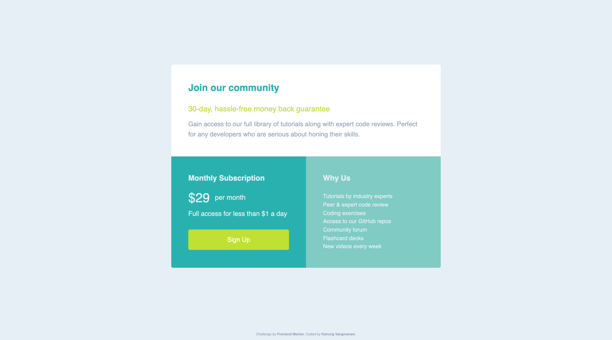
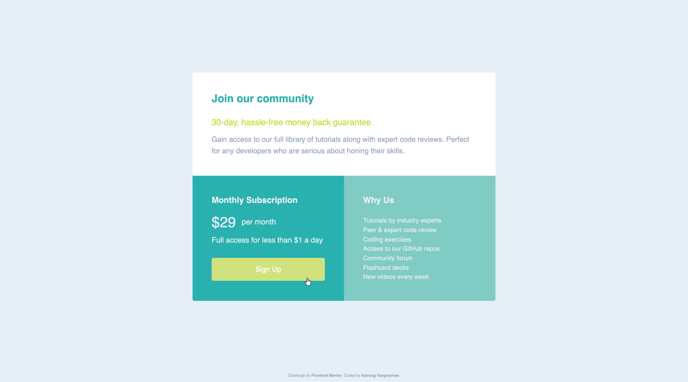

# Frontend Mentor - Single price grid component solution

This is a solution to the [Single price grid component challenge on Frontend Mentor](https://www.frontendmentor.io/challenges/single-price-grid-component-5ce41129d0ff452fec5abbbc). Frontend Mentor challenges help you improve your coding skills by building realistic projects. 


## Table of contents

- [Frontend Mentor - Single price grid component solution](#frontend-mentor---single-price-grid-component-solution)
  - [Table of contents](#table-of-contents)
  - [Overview](#overview)
    - [The challenge](#the-challenge)
    - [Screenshot](#screenshot)
    - [Links](#links)
  - [My process](#my-process)
    - [Built with](#built-with)
    - [What I learned](#what-i-learned)
    - [Continued development](#continued-development)
    - [Useful resources](#useful-resources)
    - [AI Collaboration](#ai-collaboration)
  - [Author](#author)
  - [Acknowledgments](#acknowledgments)

## Overview

### The challenge

Users should be able to:

- View the optimal layout for the component depending on their device's screen size
- See a hover state on desktop for the Sign Up call-to-action

### Screenshot

<details>
<summary>Mobile view</summary>

</details>
<details>
<summary>Desktop view</summary>

</details>
<details>
<summary>Active state view</summary>

</details>

### Links

- Solution URL: [Single Price Grid Component solution using React, Vite, CSS Grid & BEM](https://www.frontendmentor.io/solutions/single-price-grid-component-solution-using-react-vite-css-grid-and-bem-pczRGp_80M)
- Live Site URL: [Frontend Mentor | Single Price Grid Component](https://challenged-by-frontend-mentor.github.io/single-price-grid-component/)

## My process

### Built with

- Semantic HTML5 markup
- CSS custom properties (CSS Variables)
- CSS Grid (Template Areas & Responsive Columns)
- Flexbox
- Mobile-first workflow
- Modern CSS BEM (Block Element Modifier) methodology
- Web Accessibility (a11y) standards & Focus States (`:focus-visible`)
- Google Fonts integration (Karla)

### What I learned

Working through this project allowed me to practice and master several core frontend concepts:

1. **CSS Grid Area Architecture & Responsive Layouts**: Structuring the price card layout seamlessly from single-column mobile to multi-column desktop grids using `grid-template-areas`.
2. **Strict BEM Naming Convention**: Eliminating deep CSS nesting in favor of flat, predictable element naming (`.price-card__hero`, `.price-card__cta-btn`).
3. **Accessibility & Focus Indicators**: Crafting custom `:focus-visible` states with clear outlines and offset borders to satisfy WCAG contrast requirements without degrading visual appeal.
4. **Layout Spacing & Overflow Protection**: Balancing container paddings and `min-height` settings across viewports to avoid layout collisions on low-height mobile screens.

```css
/* Accessible Focus State Indicator */
.price-card__cta-btn:focus-visible {
  background-color: var(--clr-cta-btn-hover);
  outline: 3px solid var(--clr-white);
  outline-offset: 2px;
}
```

### Continued development

Moving forward, I plan to continue refining my skills in:

- Advanced layout strategies using modern CSS Grid features (`auto-fit`, `auto-fill`, and subgrid).
- Building components with complete keyboard navigation support and custom ARIA patterns.
- Expanding component scalability and asset optimization for production-ready frontend workflows.

### Useful resources

- [MDN Web Docs: CSS Grid Layout](https://developer.mozilla.org/en-US/docs/Web/CSS/Reference/Properties/grid) - Essential reference for grid setup, template areas, and alignment parameters.
- [A Complete Guide to CSS Grid (CSS-Tricks)](https://css-tricks.com/snippets/css/complete-guide-grid/) - Highly visual guide for mastering grid properties and responsive structures.

### AI Collaboration

- **Tools Used**: Gemini & Google Search AI mode.
- **Role in Workflow**: Assisted in code reviews, evaluating CSS BEM specificity, validating accessibility contrast for interactive CTA states, and fine-tuning responsive padding logic.
- **Key Takeaways**: Iterative AI code reviews helped catch edge-case layout bugs early, ensuring high code quality and strict adherence to modern frontend standards.

## Author

- GitHub: [Kirung Vangmanaw](https://github.com/VangmanawKairung)
- Frontend Mentor - [@VangmanawKairung](https://www.frontendmentor.io/profile/VangmanawKairung)

## Acknowledgments

I want to express my deepest gratitude to myself for the dedication, persistence, and continuous effort put into completing this challenge. Special thanks to my family for their unwavering support and encouragement throughout my learning journey. I am also extremely grateful to the Frontend Mentor team for creating such engaging, realistic challenges that help developers hone their skills. 

Finally, my practical development workflow wouldn't be complete without essential tools such as Visual Studio Code, Preview on macOS for visual inspection, and AI assistants (Gemini and Google Search AI mode), which served as invaluable technical partners during debugging and code refinement.
